# 基于springboot+vue的在线教育系统

<h4 style='color:red'>联系不到我，就看我的主页 </h4> 
 
#### 介绍

随着互联网技术的飞速发展，在线教育成为了教育领域的重要组成部分。为了满足人们日益增长的学习需求，提供更加优质、便捷和个性化的教育服务，我们开发了这套基于 Spring Boot + Vue 的在线教育系统。该系统整合了丰富的教育资源，通过互联网将优质的教育内容传递给广大学习者，打破了时间和空间的限制，为学习者创造了更加灵活和高效的学习环境。

#### 技术栈

后端技术栈：Springboot+Mysql+Maven

前端技术栈：Vue+Html+Css+Javascript+ElementUI

开发工具：Idea+Vscode+Navicate

#### 系统功能介绍

（一）管理员角色  
个人中心：管理员可以在此查看和修改个人信息，设置系统通知和提醒方式。  
用户管理：全面管理系统中的用户信息，包括用户的注册、登录、个人资料、学习记录等。可以对用户进行权限分配、账号冻结或解冻等操作。  
讲师管理：负责讲师的招募、审核、信息维护以及教学质量评估。可以查看讲师的授课记录、学生评价等数据，以决定是否继续合作或给予奖励。  
普通管理员管理：对普通管理员的权限进行设置和调整，监督其工作情况，确保系统的日常运营稳定有序。  
课程管理员管理：对课程管理员进行岗位分配、工作监督和绩效考核，以保障课程管理工作的高效进行。  
课程管理：对系统中的所有课程进行统筹规划，包括课程的创建、编辑、发布、下架等操作。可以设置课程的分类、标签、难度级别等属性，以方便用户筛选和查找。  
课程分类管理：根据不同的学科领域、教学目标和受众群体，对课程进行细致的分类，方便用户快速定位所需课程。  
教师管理：维护教师的基本信息、教学经历、擅长科目等资料，为课程安排提供参考。  
名师管理：重点打造和推广知名教师的品牌形象，提高系统的吸引力和竞争力。  
系统管理：负责系统的整体配置、参数设置、数据备份与恢复、安全防护等关键任务，确保系统的稳定运行和数据安全。  
订单管理：处理用户的课程购买订单，包括订单确认、支付处理、发票开具等环节，保障交易的顺利完成。  

（二）普通管理员角色  
课程：浏览和查看系统中的各类课程信息，了解课程的详细内容和教学安排。  
教师：查看教师的个人资料和教学履历，为课程安排和教学质量监督提供参考。  
个人中心：修改个人信息，查看工作任务和通知。  
后台管理  
用户管理：对普通用户的信息进行简单管理，如用户信息的查看、修改和权限调整。  
购物车：可以将感兴趣的课程添加到购物车，方便后续购买。  

（三）课程管理员角色  
课程：对课程进行全面管理，包括课程的设计、内容更新、教学资源整合等。  
教师：协助安排教师的授课任务，与教师沟通教学计划和要求。  
个人中心：更新个人信息，查看工作相关的通知和提醒。  
后台管理  
课程管理员管理：对其他课程管理员的工作进行协调和分配。  
课程管理：负责具体课程的日常维护，如课程资料的更新、学生作业的批改等。  
课程分类管理：根据课程的特点和需求，对课程进行合理分类，方便用户查找和选择。  
购物车：添加所需的课程相关资源或工具到购物车。  

（四）讲师角色  
课程：准备和实施自己负责的课程教学，包括课程资料的准备、教学活动的组织等。  
教师：与其他讲师进行交流和合作，共同提高教学质量。  
个人中心：完善个人教学资料，查看课程安排和学生反馈。  
后台管理  
课程管理：制定课程教学计划、更新课程内容、设置课程作业和考试。  
教师管理：与其他教师协作备课、交流教学经验。  
名师管理：参与名师评选活动，提升个人教学品牌影响力。  
购物车：选购教学所需的辅助资源或工具。  

（五）用户角色  
课程：根据自己的需求和兴趣选择课程，查看课程详情、教学大纲和评价。  
教师：了解教师的教学风格和专业背景，选择适合自己的教师。  
个人中心：修改个人资料，查看学习进度和购买记录。  
后台管理  
课程管理：收藏感兴趣的课程，对已学习的课程进行评价和反馈。  
教师管理：关注喜欢的教师，获取教师的最新课程和动态。  
名师管理：查看名师推荐，选择名师课程进行学习。  
我的收藏管理：管理自己收藏的课程和教师信息。  
订单管理：查看课程购买订单的状态和详情。  
购物车：将心仪的课程添加到购物车，进行结算购买。  

#### 系统作用

提供便捷的学习途径  
学习者可以随时随地通过网络访问系统，根据自己的时间和节奏安排学习，打破了传统教育的时空限制。  
丰富的教育资源整合  
整合了各类优质的教育课程和师资，为用户提供了更多的选择，满足了不同用户的多样化学习需求。  
个性化学习体验  
用户可以根据自己的兴趣、能力和学习目标定制学习计划，系统能够根据用户的学习行为和偏好推荐合适的课程和教师。  
高效的教学管理  
为教育机构和管理者提供了全面的管理工具，能够有效地组织教学资源、监控教学质量、评估教师绩效，提高教育管理的效率和科学性。  
促进教育公平  
使得优质的教育资源能够覆盖更广泛的人群，无论身处何地，只要有网络，都能享受到高质量的教育服务，有助于缩小城乡、区域之间的教育差距。  
数据驱动的教育决策  
系统通过收集和分析用户的学习数据、课程评价等信息，为教育机构提供决策依据，以便不断优化课程设置、改进教学方法、提升服务质量。  

#### 系统功能截图

代码结构

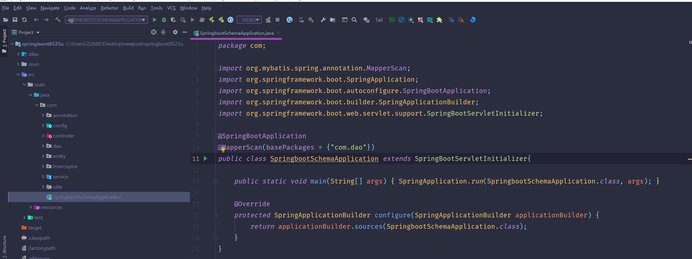

数据库表

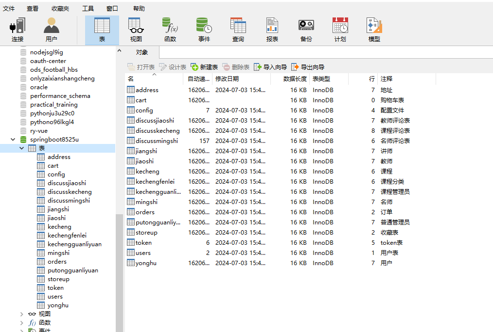

登录

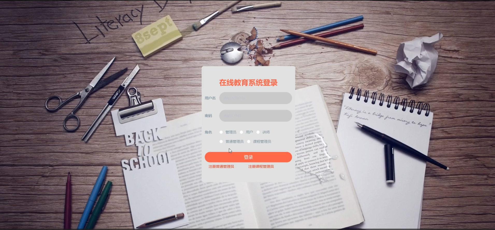

课程管理员管理

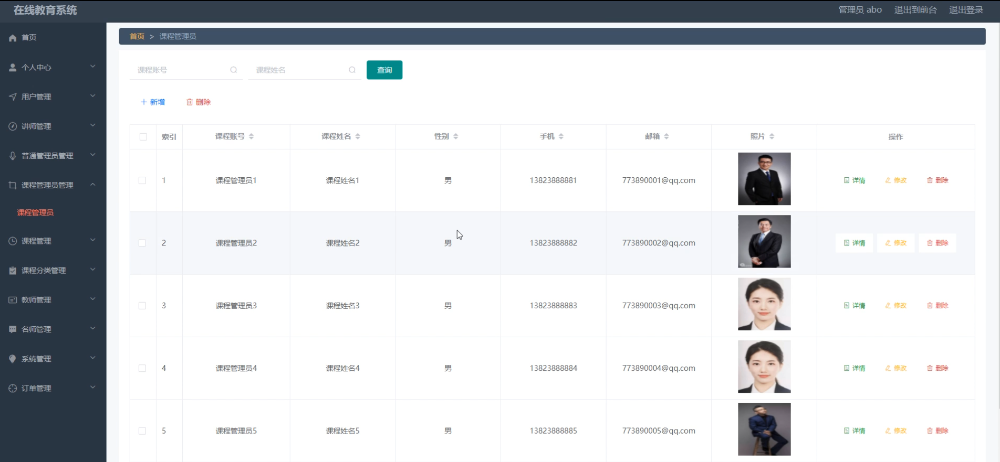

课程分类管理

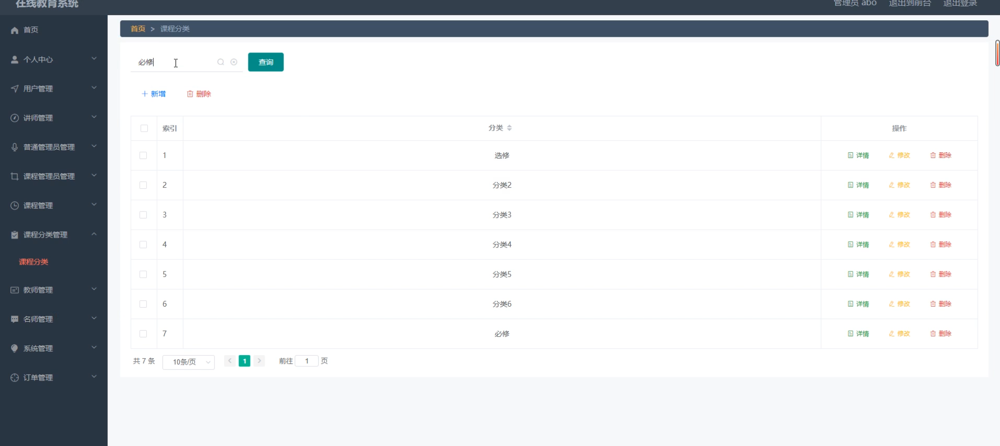

普通管理员用户管理

课程管理员课程分类管理

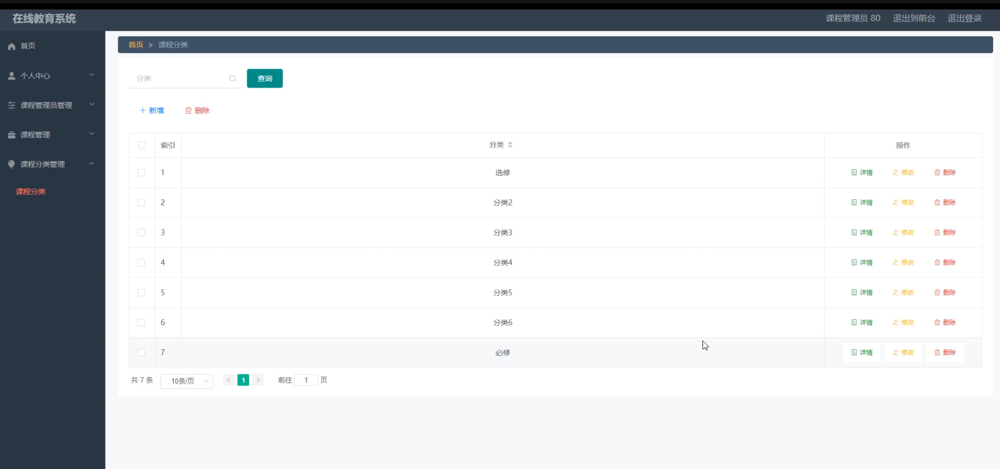

课程管理

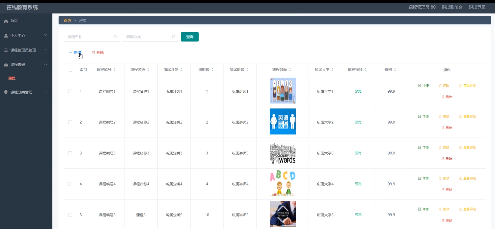

讲师管理

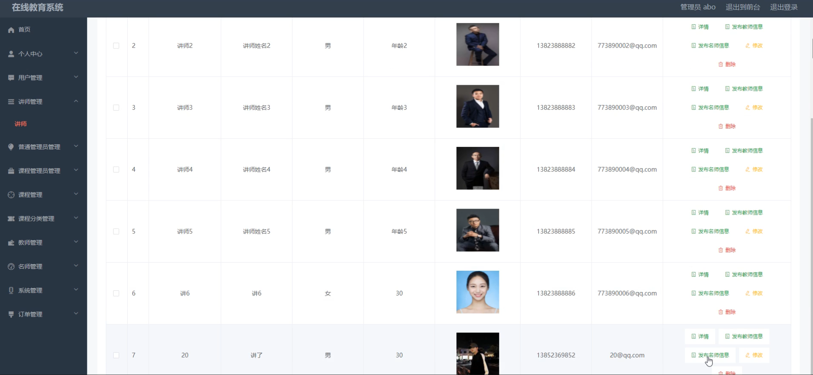

系统管理

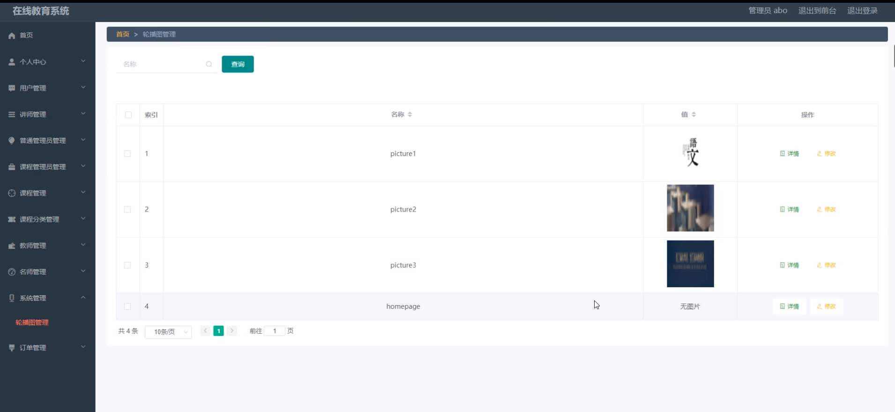

前台页面首页

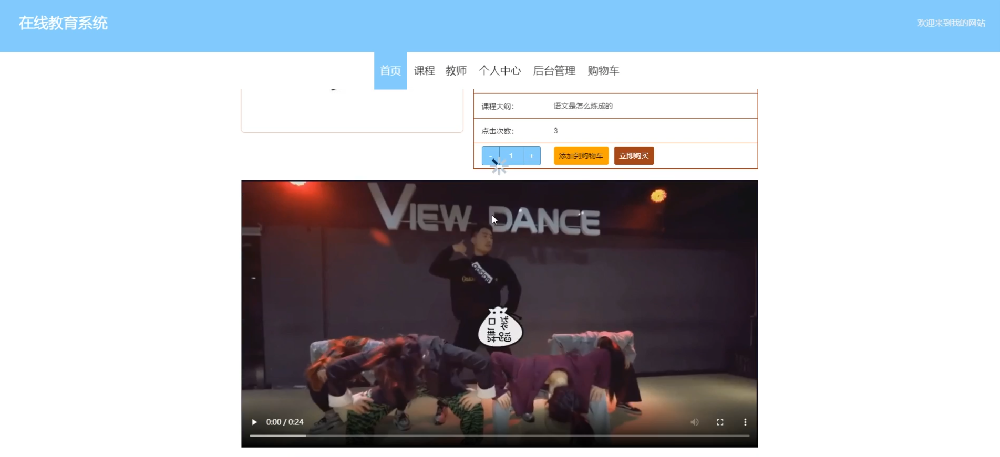

个人中心

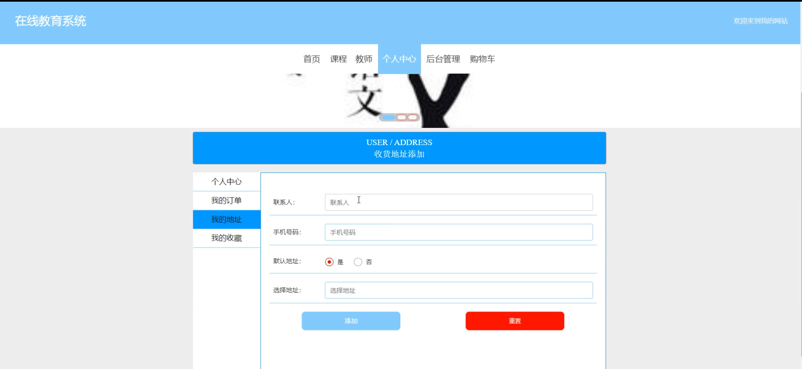

购物车

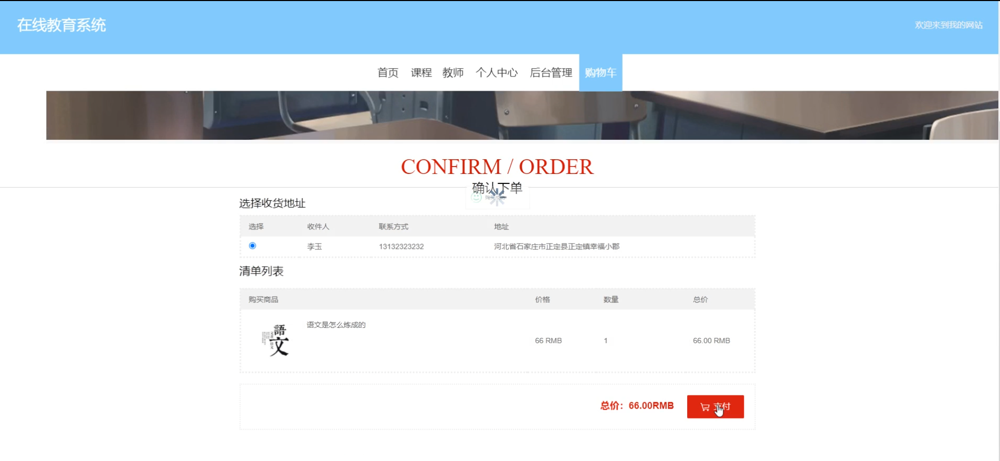

用户端后台管理

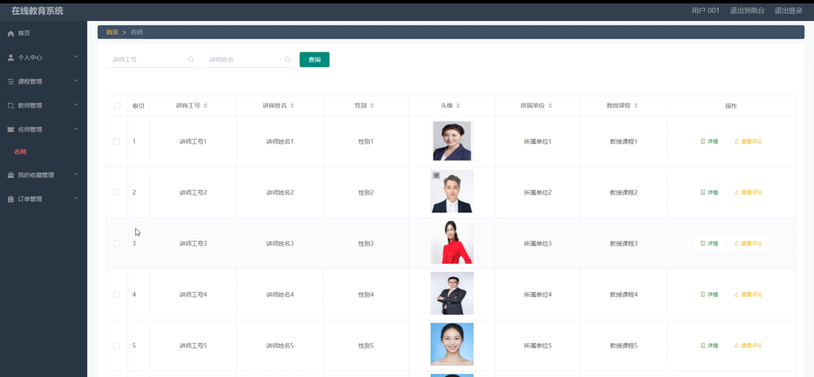

讲师端名师管理

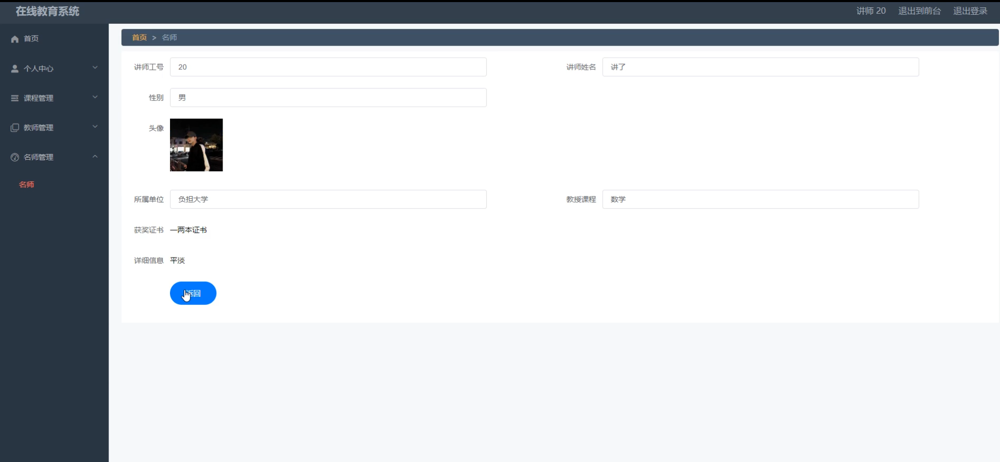

#### 总结

本基于 Spring Boot + Vue 的在线教育系统，通过清晰的角色划分和丰富的功能模块，构建了一个集教学、管理和学习于一体的综合性在线教育平台。它不仅为学习者提供了优质、便捷和个性化的学习环境，也为教育机构和管理者提供了高效、科学的管理手段，对于推动教育信息化、促进教育公平和提高教育质量具有重要的意义。未来，我们将持续关注技术发展和用户需求的变化，不断优化和完善系统功能，为在线教育事业的发展贡献更大的力量。

#### 使用说明

创建数据库，执行数据库脚本 修改jdbc数据库连接参数 下载安装maven依赖jar 启动idea中的springboot项目

后台地址：http://localhost:8080/springboot8525u/admin/dist/index.html

管理员  abo 密码 abo

前台地址：http://localhost:8080/springboot8525u/front/index.html
